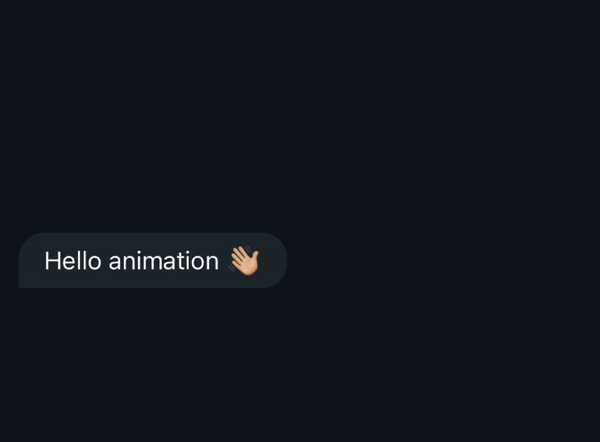

# Reactions bubble

<div align="center">
  
</div>

## Introduction

This repository contains the source code used to remake the WhatsApp reactions bubble using React Native and Reanimated 3

## Usage example

The same example can be found in App.tsx

```jsx
export default function App() {
  const [selectedReaction, setSetselectedReaction] = useState<string>();

  return (
    <View style={containerStyle}>
      <ReactionBubble
        reactions={["👍", "❤️", "😂", "😮", "😢", "🤲"]}
        selectedReaction={selectedReaction}
        onReactionPress={(reaction) => setSetselectedReaction(reaction)}
        style={chatStyle}
        bubbleStyle={chatBubbleStyle}
        reactionStyle={chatBubbleStyle}
        highlightColor="#192329"
      >
        <Text style={chatTextStyle}>Hello animation 👋🏼</Text>
      </ReactionBubble>
    </View>
  );
}

const { containerStyle, chatStyle, chatBubbleStyle, chatTextStyle } =
  StyleSheet.create({
    containerStyle: {
      flex: 1,
      justifyContent: "center",
      alignItems: "flex-start",
      backgroundColor: "#0C151B",
      paddingHorizontal: 16,
    },
    chatStyle: {
      borderRadius: 16,
      borderBottomStartRadius: 2,
      backgroundColor: "#202A30",
      paddingVertical: 8,
      paddingHorizontal: 16,
    },
    chatBubbleStyle: { backgroundColor: "#202A30" },
    chatTextStyle: { color: "white", fontSize: 16 },
  });
```
